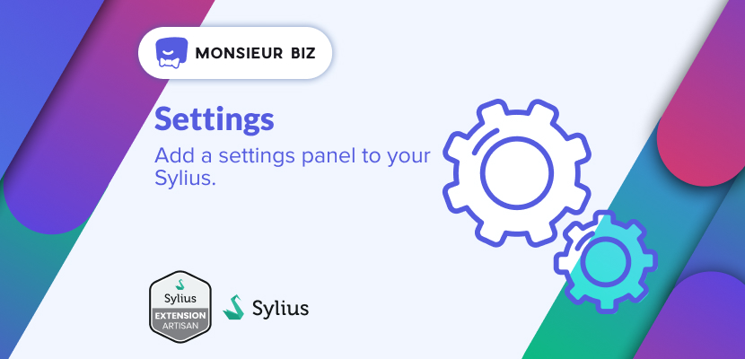

[](https://monsieurbiz.com/agence-web-experte-sylius)

<h1 align="center">Settings for Sylius</h1>

[](https://github.com/monsieurbiz/SyliusSettingsPlugin/blob/master/LICENSE.txt)
[](https://github.com/monsieurbiz/SyliusSettingsPlugin/actions?query=workflow%3ATests)
[](https://github.com/monsieurbiz/SyliusSettingsPlugin/actions?query=workflow%3ASecurity)
[](https://github.com/monsieurbiz/SyliusSettingsPlugin/actions?query=workflow%3ASecurity)

This plugin gives you the ability to have Plugins oriented settings in your favorite e-commerce platform, Sylius.


## Compatibility

| Sylius Version | PHP Version |
|---|---|
| 1.11 | 8.0 - 8.1 |
| 1.12 | 8.1 - 8.2 |
| 1.13 | 8.1 - 8.2 |

## Installation

If you want to use our recipes, you can configure your composer.json by running:

```bash
composer config --no-plugins --json extra.symfony.endpoint '["https://api.github.com/repos/monsieurbiz/symfony-recipes/contents/index.json?ref=flex/master","flex://defaults"]'
```

```bash
composer require monsieurbiz/sylius-settings-plugin
```

<details>
<summary>⚠️ Warning: For Doctrine DBAL < 3.0</summary>
<p>

You have to ignore migration `Version20240710130300.php` if you are under Doctrine DBAL < 3.0.
```
console doctrine:migrations:version 'MonsieurBiz\SyliusSettingsPlugin\Migrations\Version20240710130300' --add
```
</p>
</details>

<details><summary>For the installation without flex, follow these additional steps</summary>
<p>

Change your `config/bundles.php` file to add this line for the plugin declaration:
```php
<?php

return [
    //..
    MonsieurBiz\SyliusSettingsPlugin\MonsieurBizSyliusSettingsPlugin::class => ['all' => true],
];  
```

Then create the config file in `config/packages/monsieurbiz_settings_plugin.yaml` :

```yaml
imports:
    - { resource: "@MonsieurBizSyliusSettingsPlugin/Resources/config/config.yaml" }
```

Finally import the routes in `config/routes/monsieurbiz_settings_plugin.yaml` : 

```yaml
monsieurbiz_sylius_settings_admin:
    resource: "@MonsieurBizSyliusSettingsPlugin/Resources/config/routes/admin.yaml"
    prefix: /%sylius_admin.path_name%
```

</p>
</details>  

Update your database:

```bash 
bin/console doctrine:migration:migrate
```

Continue to "[How it works](#how-it-works)" to add your first setting for your store.

*Note:* you may encounter an error during the installation via composer if you let it run the scripts.  
Copy the configuration files and rerun the `composer require`, it should work. This is due to the use of other plugins in the DI.
The configuration is then required to run any console command.

## How it works

As a good start you can have a look at:

- The [configuration file](dist/config/packages/monsieurbiz_settings_plugin_custom.yaml) to add your own settings.
- The [form with your own fields](dist/src/Form/SettingsType.php).

Then you can get your settings using a twig function: `setting()`.  
Have a look at [this example](dist/templates/views/message.html.twig).

You can also use the DI to get your Settings, as example with the settings in the test Application `app.default`:

```bash
$ ./bin/console debug:container | grep app.settings.default
  MonsieurBiz\SyliusSettingsPlugin\Settings\Settings $defaultSettings                    alias for "app.settings.default"
  MonsieurBiz\SyliusSettingsPlugin\Settings\SettingsInterface $defaultSettings           alias for "app.settings.default"
  app.settings.default                                                                   MonsieurBiz\SyliusSettingsPlugin\Settings\Settings
```

*Note:* the "Settings" menu won't appear until you have at least one setting.

### Fetch settings

```php
use MonsieurBiz\SyliusSettingsPlugin\Provider\SettingsProviderInterface;
//...

    private SettingsProviderInterface $settingsProvider;

    public function __construct(SettingsProviderInterface $settingsProvider)
    {
            $this->settingsProvider = $settingsProvider;
    }
    
    public function myAwesomeMethod()
    {
        return $this->settingsProvider->getSettingValue('app.default', 'demo_message')
    }
```

### Use fixtures

We've implemented a fixtures loader to help you to create your settings if you need to have different settings for your
tests or project (by channel, by locale…).

You need to create a yaml file with your fixtures, like explained in the documentation of Sylius.  
You can find our own example in the source code, section `sylius_fixtures`: [configuration file](dist/config/packages/monsieurbiz_settings_plugin_custom.yaml).

It's also possible to run test fixtures with a local suite in development: `make sylius.fixtures.local`.

By default, a fixture will replace the value of a setting if it already exists. 
If you want to keep a value as it is in the database when running this fixture, you can use the flag `ignore_if_exists: true` for each element that you want to be kept.

### Extends existing settings form

If you want to add a field to an existing settings form (like in another plugin), you can check [the example in the test app](dist/src/Form/SettingsExtensionType.php)

### Use CLI

You can use a CLI command to set a value for a setting directly from the console:
`$ ./bin/console monsieurbiz:settings:set {alias} {path} {value} --channel="FASHION_WEB" --locale="en_US" --type="text"`


Examples:
```bash
$ ./bin/console monsieurbiz:settings:set app.default demo_message 'fashion message' --channel="FASHION_WEB" --locale="en_US"
$ ./bin/console monsieurbiz:settings:set app.default demo_json '{"foo":"baz"}' --channel="FASHION_WEB" --locale="en_US" --type="json"
$ ./bin/console monsieurbiz:settings:set app.default demo_datetime '2023-07-24 01:02:03' --channel="FASHION_WEB" --locale="en_US" --type="datetime"
$ ./bin/console monsieurbiz:settings:set app.default enabled 0
```
The options channel and locale can be omitted if you want to set the value for a global scope.
If a value exists for the given scope the type can be omitted as it will be the same as the existing one unless you want to change the type.
For a new value you need to specify the type.

⚠️ When specifying the type, be sure to know what you are doing as it should be coherent with the Form Type of the field.

### Use cache

Settings use `cache.adapter.array` adapter by default. If you want to increase performance, you can use 
`cache.adapter.apcu`, `cache.adapter.redis` or any adapters instead.   


You had to add the following lines to your config file:

```yaml
monsieurbiz_sylius_settings:
    cache_adapter: cache.adapter.apcu
```

## Contributing

You can find a way to run the plugin without effort in the file [DEVELOPMENT.md](./DEVELOPMENT.md).

Then you can open an issue or a Pull Request if you want! 😘  
Thank you!

## License

This plugin is completely free and released under the [MIT License](https://github.com/monsieurbiz/SyliusSettingsPlugin/blob/master/LICENSE).
